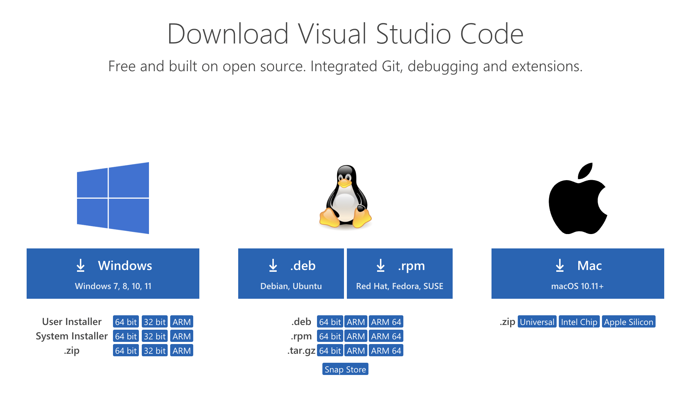
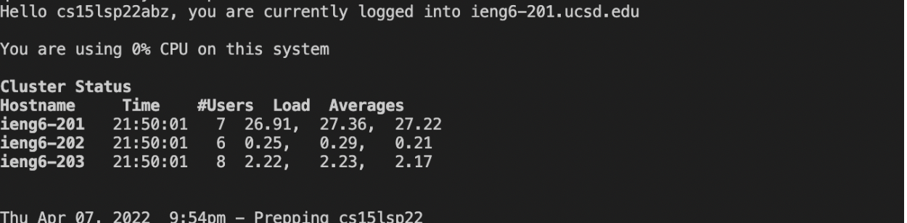
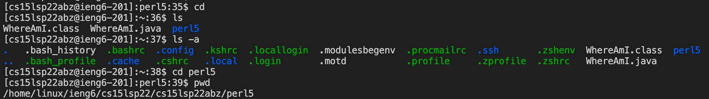
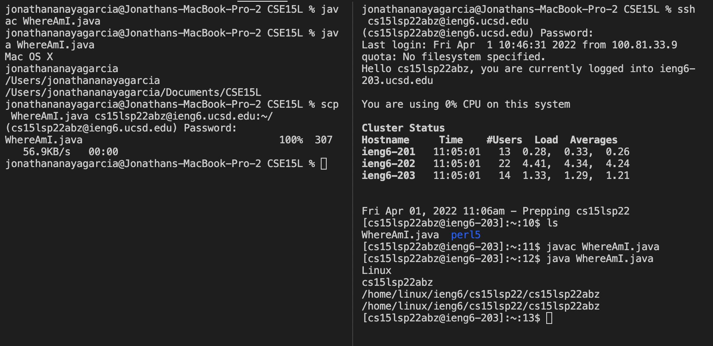
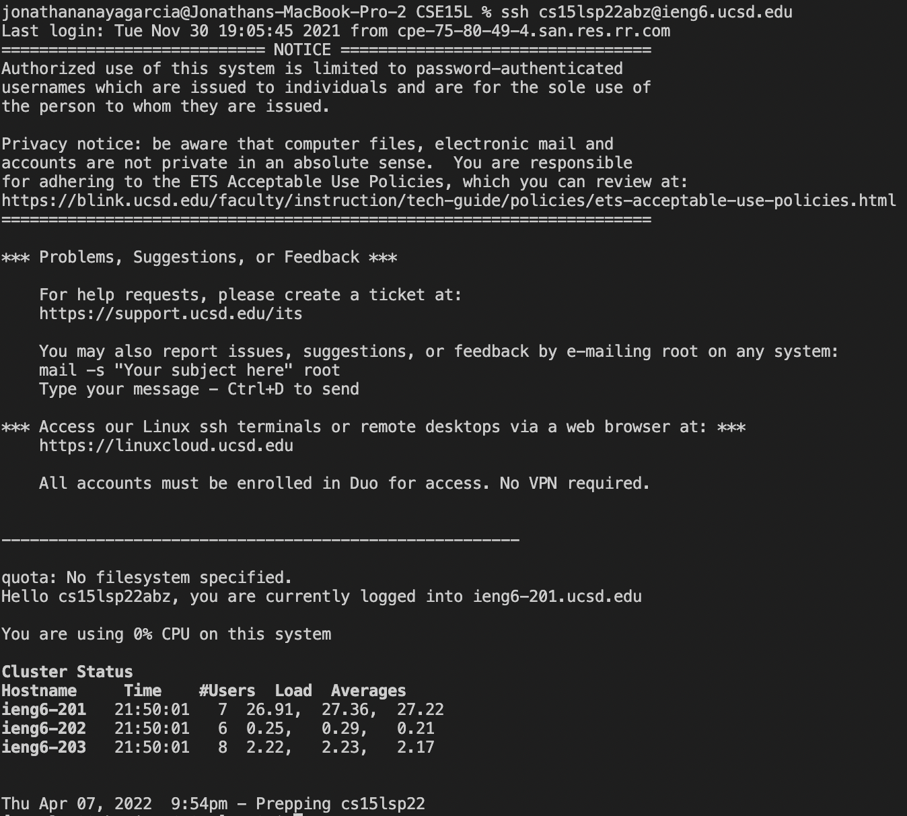

# Tutorial for Remote Access

Hello incoming 15L students! My name is Jonathan and I will be showing you how to log into a course-specific account on ieng6.

1. ### Installing VScode
    You are first going to want to install VScode. Go to [VScode download link](https://code.visualstudio.com/download). Once there select the appropriate operating system(what your computer uses MacOs, Windows, linux etc). Follow the promts and agree to terms and conditions.
    

2. ### Remotely Connecting
    Next we are going to be connecting remotely. This will allow us to connect to a computer that belongs to UCSD through the internet. If you are on Windows, first [install OpenSSH](https://docs.microsoft.com/en-us/windows-server/administration/openssh/openssh_install_firstuse). Now open VScode and open your terminal and type "ssh cs15lsp22abc@ieng6.ucsd.edu" Where the "abc" is located you are going to want to put in your own unique letters from your account. Now say "yes" to the question they ask. Finally enter your password for this account. This is what it should look like upon successful login.
    

3. ### Trying Some Commands
    Let's try some commands! The "cd" command following a directory name will allow you to change your directory. "ls" will list the folders in your current directory. "ls -a" will also list the folders inside your directory including hidden ones. It should look like this.
    

4. ### Moving Files with scp
    Now lets try moving files between computers with the "scp" command. Let's say you have a file in your computer you want to send to the remote/ucsd computer, you are going to want to type "scp NAMEOFFILE.java cse15lsp22abc@ieng6.uscd.edu:~/" into the terminal. The NAMEOFFILE.java being the name of the file and to the right of that is your account name on the remote computer followed by some symbols. Enter your password and you should be good.
    

5. ### Setting an SSH Key
    Let's set up the SSH Key! On your personal computer type "ssh-keygen" then "(/Users/<user-name>/.ssh/id_rsa): /Users/<user-name>/.ssh/id_rsa" DO NOT PUT A PASSPHRASE. Simply press enter two times. Now log into the remote computer and in the remote computer's terminal type "mkdir .ssh" You should then log out and go to our personal computer's terminal and type "scp /Users/<user-name>/.ssh/id_rsa.pub cs15lsp22zz@ieng6.ucsd.edu:~/.ssh/authorized_keys" using appropriate account name and path. Now you should be able to log into the remote computer without having to type a password :)
    
    test

6. ### Optimizing Remote Running
    A neat little trick for making remote running faster and smoother is combining what you want to do into one line. For example in your personal computer's terminal type: ssh cs15lsp22abz@ieng6.ucsd "javac FILENAME.java; java FILENAME" This will compile and run your file. You can also use the up arrow to go to the last command you made on your computer.
    

    **HOPE THIS HELPED!**

