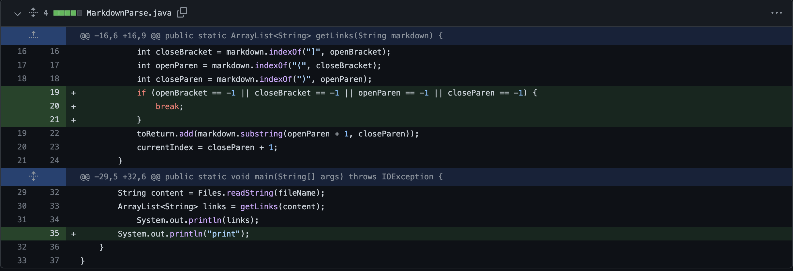
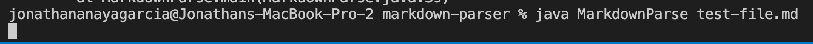
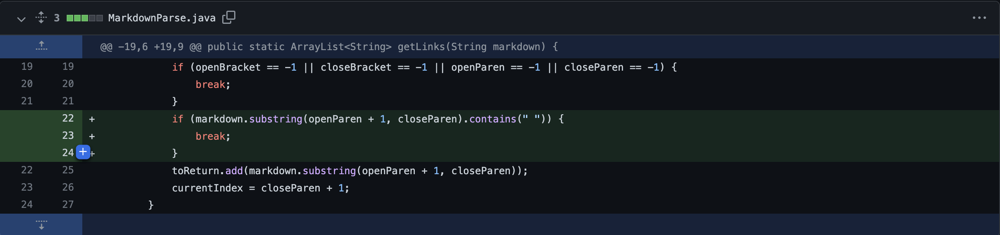
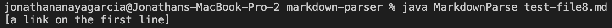
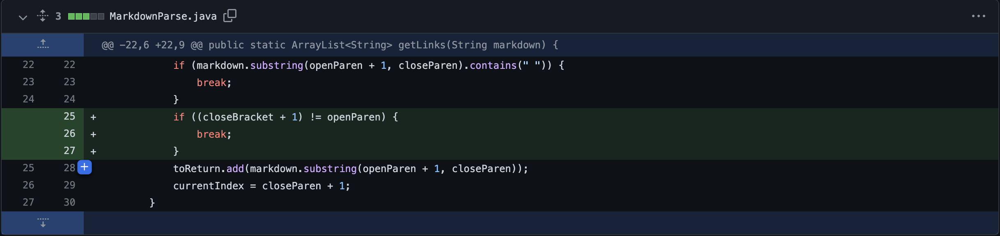
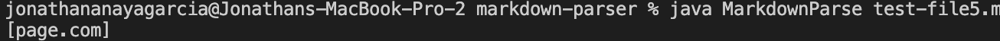

# Lab Report 2 Week 4

Hello, my name is Jonathan Anaya Garcia and I will be describing 3 of the code changes I did to MarkdownParse.java

### Change 1

This is the first change I made to MarkDownParse.java

Here is the file that caused the failure:
[failure-inducing input](https://github.com/janayagarcia/markdown-parser/blob/main/test-file.md)

Here is the symptom:

The bug was that the code did not take into account the scenario where the file contains an empty line. Therefore this causes the symptom of an infinite loop. By adding this "if" statement we get rid of this bug.

### Change 2

This is the second change I made to MarkDownParse.java

Here is the file that caused the failure:
[failure-inducing input](https://github.com/janayagarcia/markdown-parser/blob/main/test-file8.md)

Here is the symptom:

The bug was that the code did not contain the appropriate code to deal with a file that has spaces between the characters of the link. Therefore this causes the symptom of still returning the "link" (not really a link) in the arrayList. This should not be inluded therefore I resolved it with this "if" statement.

### Change 3

This is the third change I made to MarkDownParse.java

Here is the file that caused the failure:
[failure-inducing input](https://github.com/janayagarcia/markdown-parser/blob/main/test-file5.md)

Here is the symptom:

The bug in the code was that it did not appropriately deal with the scenario where the file has lines between the closing parenthesis and the opening bracket. This would make it an innapropriate link. Therefore the symptom is that the "link" (not actually a link) is included in the arrayList when it should not be. I resovled this by including the "if" statement shown in the screenshot.