# Lab Report 3

Hello! My name is Jonathan Anaya Garcia and I will be demonstrating how I streamlined my ssh configuration, how I setup Github access from ieng6 and how I copied whole directories.

## 1. Streamlining ssh Configuration
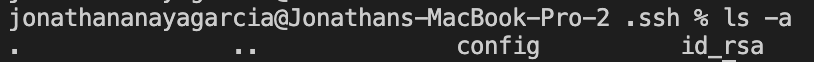
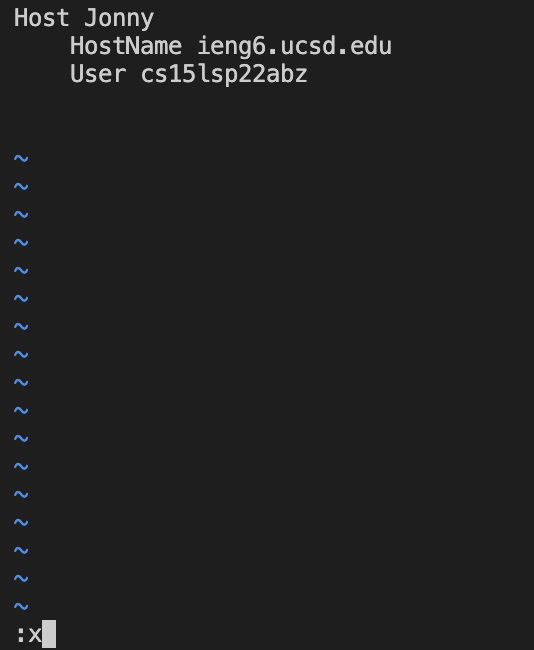
This is my `.ssh/config` file and I edited it through the terminal.

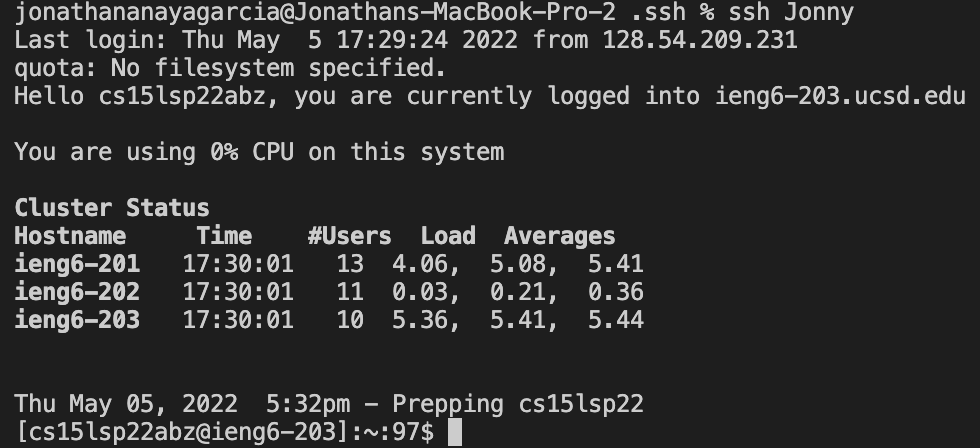
Here I am logging into my ssh with my alias.

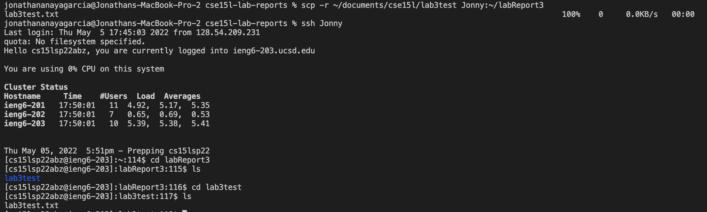
At the top of this screenshot you can see me doing the `scp` command in order to copy a file into my account.
## 2. Setup Github Access from ieng6
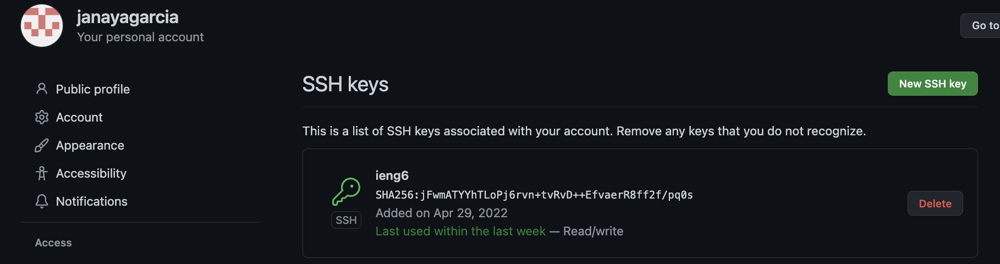
Here we see my public key in github.
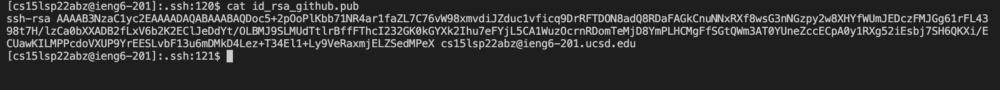
Here is what it looks like in my ieng6 account.
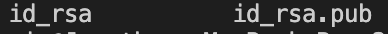
Inside of this file I have my private key and it differs from my public key because my public key has `.pub`
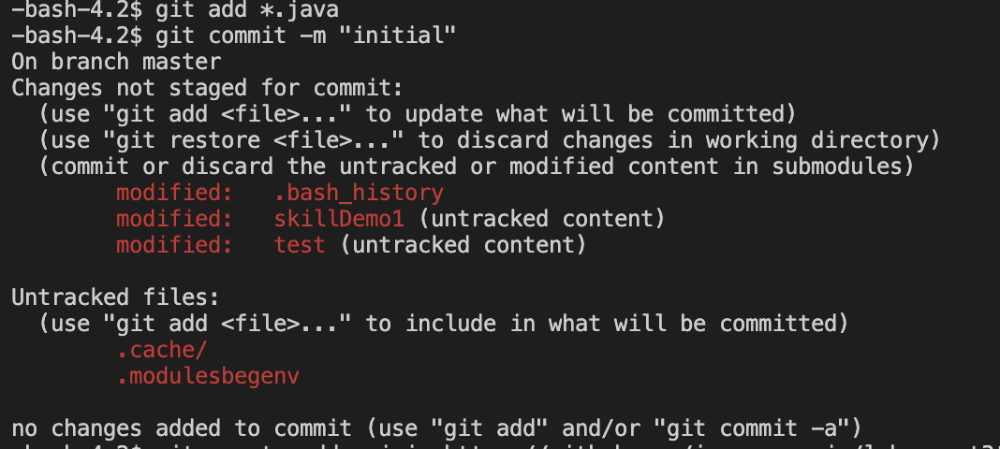
Here I commited a few files that were in my ieng6 account.
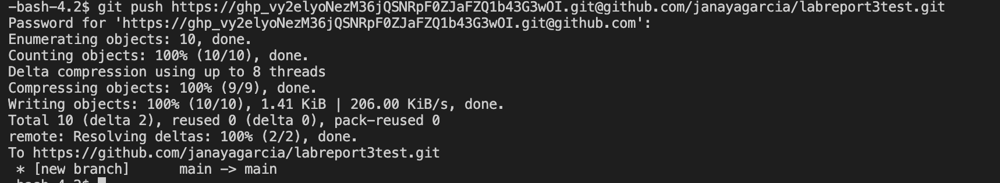
When I push these files they are added to a repository on github and you can see that with the link below.
https://github.com/janayagarcia/labreport3test

## 3. Copy Whole Directories With `scp -r`
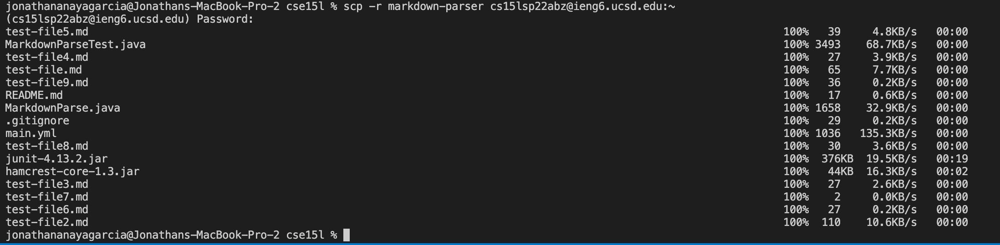
In this image I am recursively copying my markdown-parser directory.
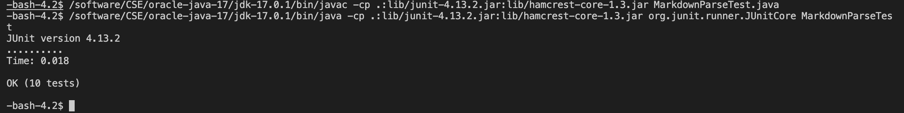
In this image I am running the Junit tests for MarkdownParseTest.
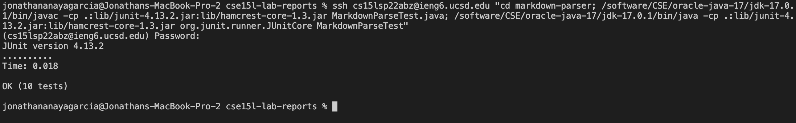
Here I do the same thing as the image above the only difference is that I am doing it all in one line.