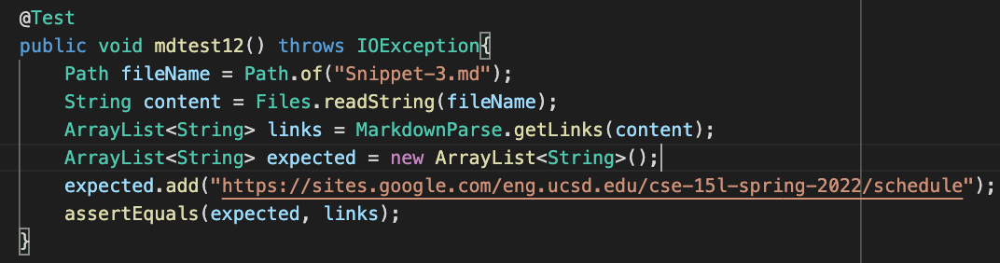
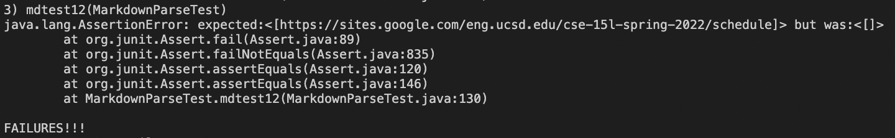

# Lab Report 4
Here is my markdown-parse:
[link to my markdown-parse repository](https://github.com/janayagarcia/markdown-parser)

TODO
Here is someone's markdown-parse:
[link to my markdown-parse I reviewed in week 7](https://github.com/janayagarcia/markdown-parser)

## Each Test:
Snippet 1: 

Expected Output: ["`google.com", "google.com", "ucsd.edu"]

Test:

My implementation: Failed.

implementation I reviewed:

Snippet 2:

Expected Output: ["a.com", "a.com(())", "example.com"]

Test: 

My implementation:
Failed.

implementation I reviewed:

Snippet 3: 

Expected Output: ["https://www.twitter.com", "https://sites.google.com/eng.ucsd.edu/cse-15l-spring-2022/schedule","https://cse.ucsd.edu"]

Test:

My implementation: Failed.

implementation I reviewed:

## Questions
1. I do think you could add some lines of code to my markdown-parse file in order to make it work with code that has backticks. I would add an if statement that would see if there are backticks before the brackets. If so it should not add this link to the arraylist.

2. I do not think that the change could be done within 10 lines of code. This is because you have to account for at least 3 more scenarios where parenthesis,brackets and/or escaped brackets are ruining the functionality of your code. It is much more involed compared to solving the issue of backticks.

3. I think this would be possible to do within 10 lines. I say this because it sounds pretty simple to do in code. All you have to do is account for emtpy space which does not seem to hard. Maybe first save it all as a string that does not have spaces between brackets and parenthesis and then run through markdown-parser.