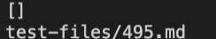
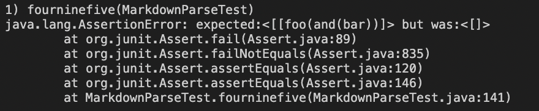
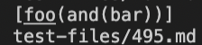
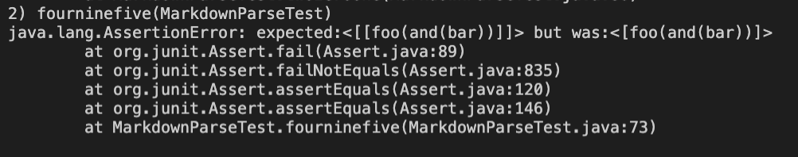
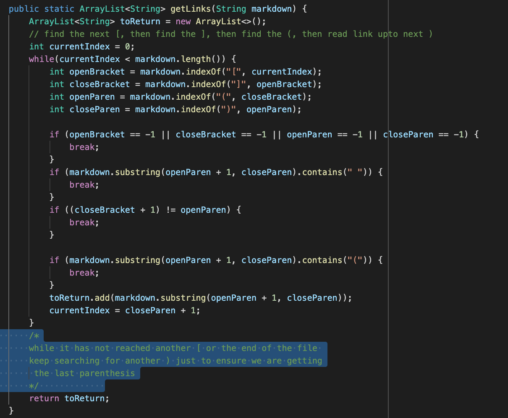
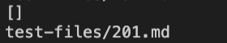
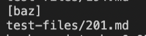
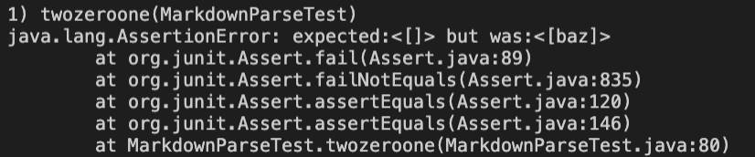
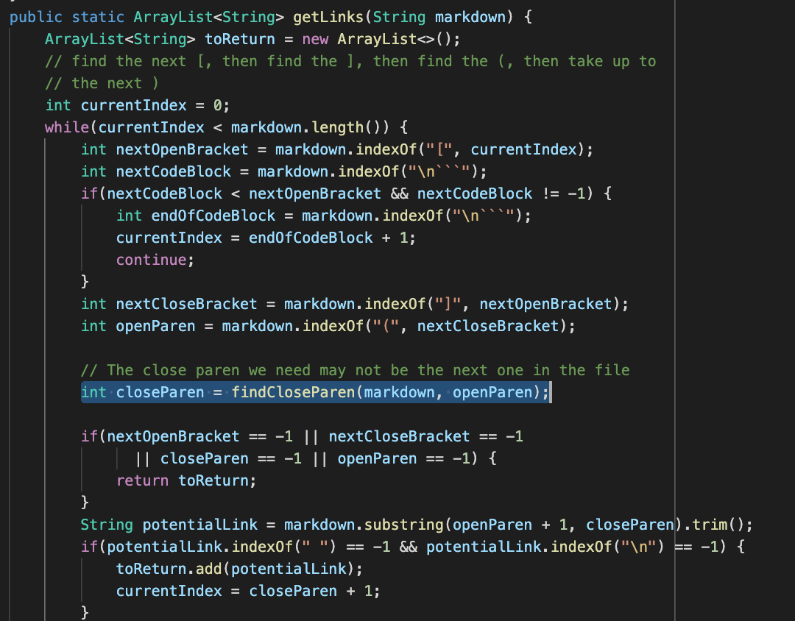
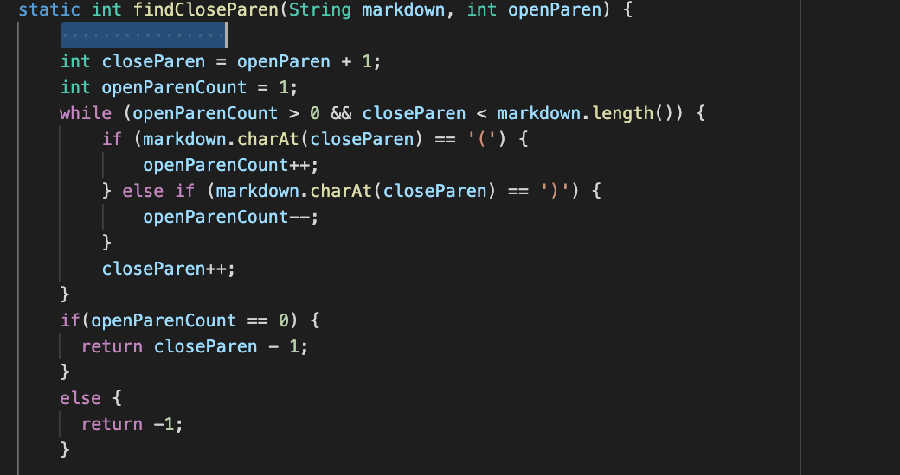

# Lab Report 5
Hello! My name is Jonathan Anaya Garcia and here is my Labreport 5.

How I found the tests with different results:

I found the tests with different results by running `time bash script.sh` in my terminal which gave me the result of every file in test-files. I added a modification of `echo $file` in order to see which file was giving which result. I ran both implementations simultaneously in order to see where it was different.

Link to the test-file with different-results: [link](https://github.com/janayagarcia/markdown-parser/tree/main/test-files)

Which implementaions are correct?
## Test 1 with 495.md
My implementation was incorrect and the one given to us was incorrect for my first test against `495.md`

Outputs:
My output:

Junit:

Their output:

Junit:

The expected output was: [[foo(and(bar))]

My implementation is not correct because it looks for the first ending parenthesis when it should look for more just incase there is a parenthesis within the link itself. It should instead do another while loop where I have highlighted until it finds another opening bracket or it reaches the end of the file. Once one of these are met it should get the rightmost closing parenthesis.

## Test 2 with 201.md
My implementation was correct but the one given to us was incorrect for my second test against `201.md`

Outputs:
My output:

Junit:
passed

Their output:

Junit:

The expected output was: []

For this I am choosing to describe the bug within the implemenation given to us. It has a simple fix. The bug is when there is space/characters between the closing bracket of a potential link it should disregard it as a proper link. This implemenation still uses the invalid link. I would fix this by adding another parameter to the findCloseParen method so that it is taking in nextCloseBracket in order to test if nextCloseBracket + 1 = openParen. If it does not equal then return -1 which makes it an invalid link.

